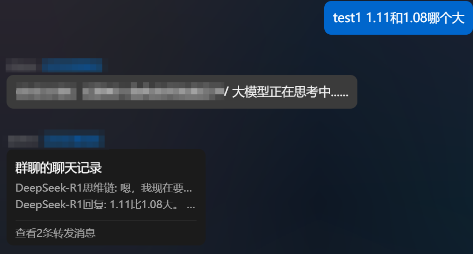
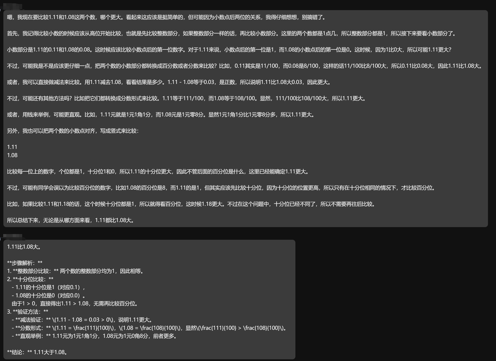

<div align="center">
  <a href="https://v2.nonebot.dev/store"></a>
  <br>
  <p></p>
</div>

<div align="center">

# nonebot-plugin-chatgpt-turbo
</div>

# 介绍
- 本插件适配OpenAI接口兼容的大模型(OpenAI官方、DeepSeek、硅基流动)
- 支持大模型思维链展示（需要模型支持）
- 本插件具有上下文回复和多模态识别（识图）功能（需要模型支持）

# 安装

* 手动安装
  ```
  git clone https://github.com/Alpaca4610/nonebot_plugin_chatgpt_turbo.git
  ```

  下载完成后在bot项目的pyproject.toml文件手动添加插件：

  ```
  plugin_dirs = ["xxxxxx","xxxxxx",......,"下载完成的插件路径/nonebot-plugin-gpt3.5-turbo"]
  ```
* 使用 pip
  ```
  pip install nonebot-plugin-chatgpt-turbo
  ```

# 配置文件

在Bot根目录下的.env文件中追加如下内容：
必填内容：

```
oneapi_key = ""  # OpenAI官方或者是支持OneAPI的大模型中转服务商提供的KEY
oneapi_model = "gpt-4o" # 调用的大模型名称
```

可选内容（填True为开启，False为关闭）：
```
oneapi_url = ""  # 中转API地址，使用deepseek请填写"https://api.deepseek.com"，使用硅基流动请填写"https://api.siliconflow.cn/v1"，使用OpenAI官方服务不需要填写
enable_private_chat = True   # 私聊开关
r1_reason = True  # DeepSeek-R1模型思维链显示开关
merge_msg = False # 是否合并转发回复
```

# 效果




# 使用方法

- @机器人发送问题时机器人不具有上下文回复的能力
- chat 使用该命令进行问答时，机器人具有上下文回复的能力
- clear 清除当前用户的聊天记录
